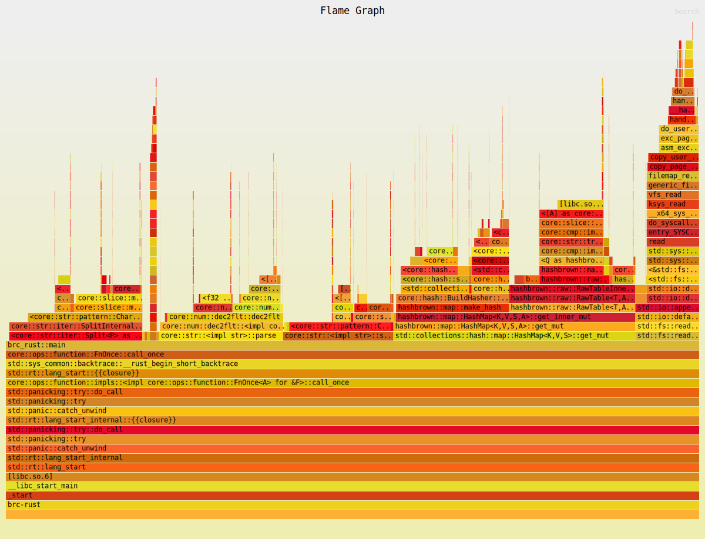
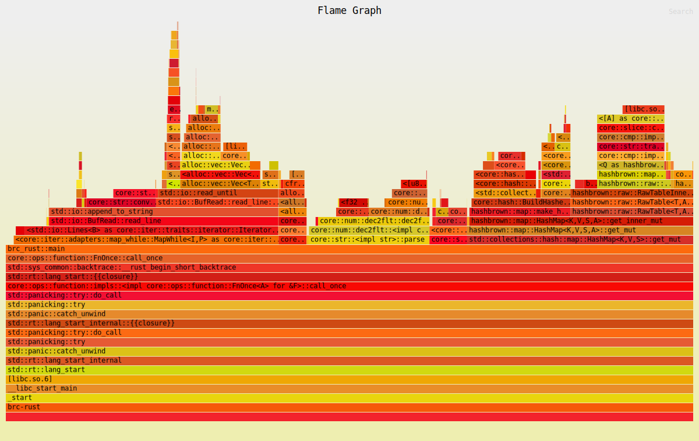
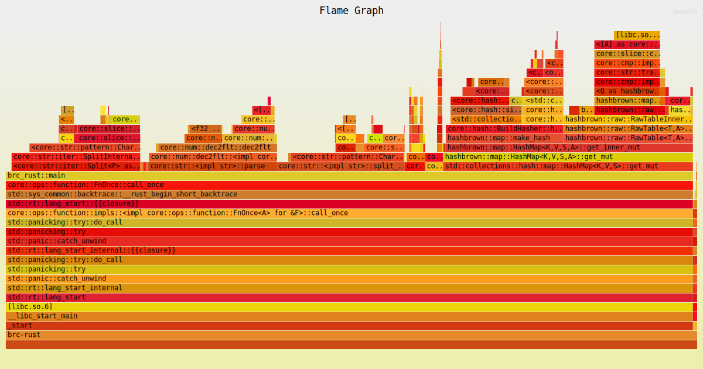
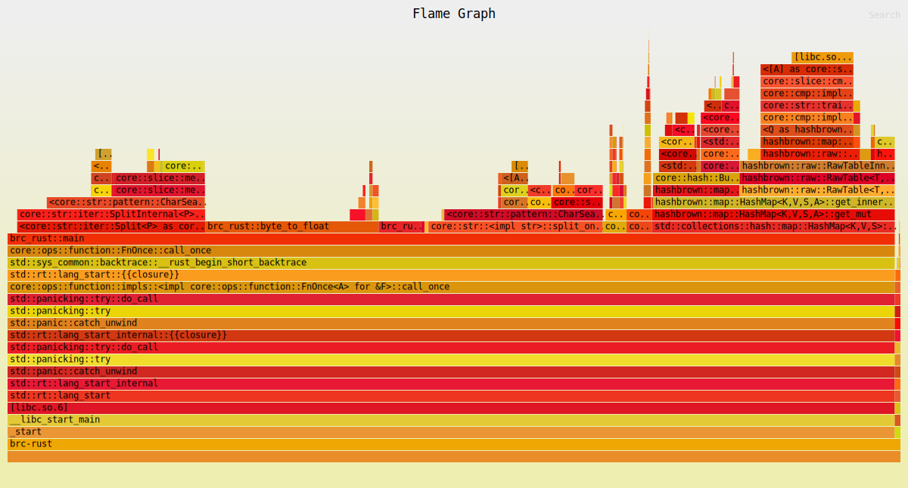
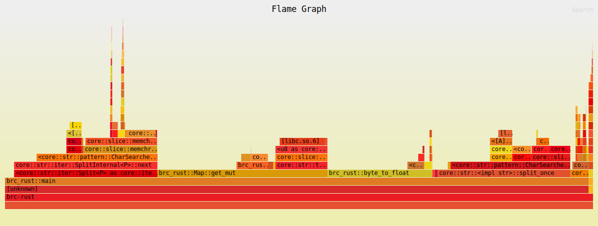
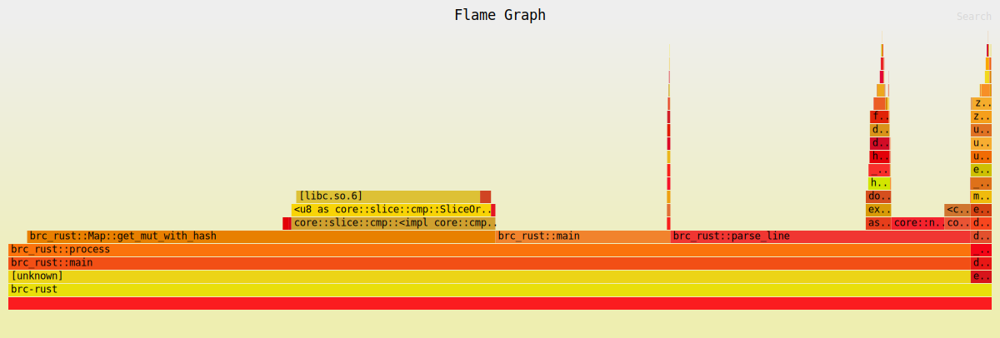
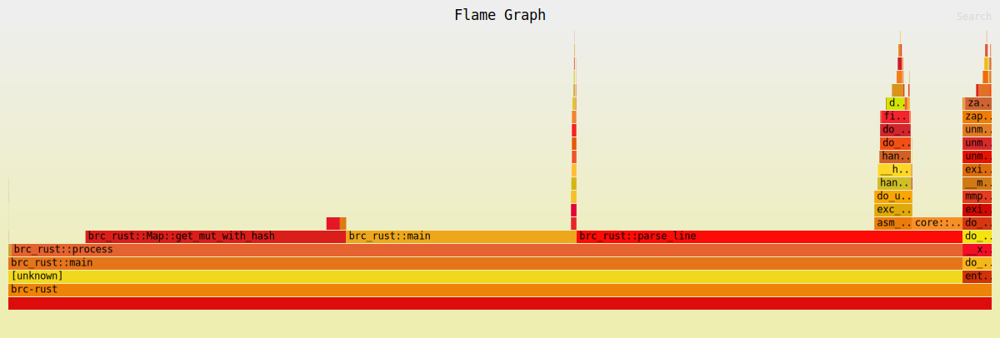

# 1BRC in Rust solution
Using 32vCPU;128GB x86 instance on AWS (m6a.8xlarge).

Baseline takes about 165 sec

## Iteration 1
- Use single thread to perform all of the operations.
- Read all the file in the memory and then process it.
- Use standard library for splitting the line and parsing them into `<location, data>`.

Total time taken: 86 sec

### Observations

- Reading the entire file into program memory and then iterating over it line by line seems to be taking about 30% of time. It might be better to read it line by line first.

## Iteration 2
- Read the file line by line but store all the lines in memory as read.
- Use standard library for splitting the line and parsing them into `<location, data>`.

Total time taken: 85 sec

### Observations

- Because the file is already in a RAMDisk so reading all at once vs reading line by line does not seem to be making any difference.
- It seems that iterating over the file this way isn't really cutting it.

## Iteration 3
- Use `mmap` to map the file into program memory and the iterate over it line by line by treating the byte slice as string. The primary win can come from the fact that we won't have to store copies of the string into memory rather can store references to these mapped memory.

Total time taken: 78 sec

### Observations

- Converting the string to float seems to be extremely costly probably due to its generic nature and handling a lot of edge cases.
- `HashMap::get_mut` seems extremely slow. Having right sized hashmap might be helpful.

## Iteration 4
- Use standard library for parsing the line but custom function for parsing the float.
- Use properly sized HashMap (we know that there are exactly 413 different cities in our dataset)

Total time taken: 74 sec
  
### Observations

- `HashMap::get_mut` is taking significant amount of time.
- `from_utf8` might be taking longer than expected as it does the checks, we might be able to get away with using the unsafe as we control the input.

## Iteration 5
- Use custom HashMap - With 98317 as table size. Tried several prime numbers from [here](https://planetmath.org/goodhashtableprimes).
- Use unsafe conversion from bytes to string

Total time taken: 62 sec

### Observations

- Our custom hash map is faster than the standard library one but is still slow, can be improved.
- Our `byte_to_float` is too generic and probably can be made specific to our data so as to improve its performance.
- It can be noticed that we are iterating over the same set of bytes over and over again. We iterate over them while:
  - Finding the newline character
  - Finding the delimiter
  - Parsing the float
  - Generating the hash

## Iteration 6
- Support hashing outside the hashmap.
- Inline the entire parsing hence we do not traverse the byte slice over and over again.
- Make the `byte_to_float` very specific to the data format, ie support `ab.c` and `b.c` only.

Total time taken: 23 sec

### Observations

- Now most of the time is spent either parsing or in retreiving the data from the hashmap.
- Significant portion of our time is spent in comparing the byte slice in hashmap.

## Iteration 7
- Our hash function is perfect therefore there are no conflicts. Given that we know our data beforehand, we should be able to remove
  - Loop from our hash map functions (no collision, no retries)
  - Bytes comparison as it is guaranteed that all of our entries get a unique hash value
- We are using bounds checks everywhere for no reason, remove them.

Total time taken: 16.5 sec

### Observations

- Flamegraph no longer yields a lot of information.
- A lot of page faults are observed.